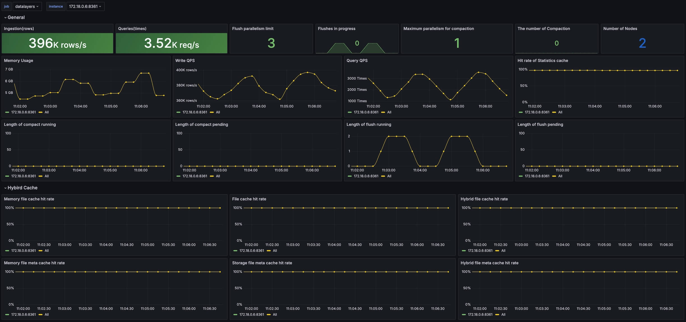

# 系统监控

Datalayers 实例启动以后，可经`8361`端口，通过 http 协议访问 `/metrics` 获得当前系统指标数据。

可通过 Prometheus 获取并存储系统监控指标，采用 Grafana 可视化展示监控的指标数据，可监控 Datalayers 的指标。

## 配置 Prometheus

如果你还未安装，请前往 <a href="https://prometheus.io/download/" target="_blank">Prometheus 官网</a>下载并安装。

安装完成后，请手动配置你的 `prometheus.yml`，增加以下配置内容：

``` yml
global:
  scrape_interval: 5s
  scrape_timeout: 5s
  evaluation_interval: 1m

- job_name: datalayers
  honor_timestamps: true
  scrape_interval: 5s
  scrape_timeout: 5s
  metrics_path: /metrics
  scheme: http
  follow_redirects: true
  enable_http2: true
  static_configs:
  - targets:
    - <your_host_ip_address>:8361
```

请注意替换`<your_host_ip_address>`为你的主机 ip 地址。

你也可以通过 Docker 快速启动 Prometheus，具体步骤如下：

1. 首先准备配置文件`prometheus.yml`，内容同上述文件相同。

2. 通过以下命令启动 prometheus 的 docker 容器:

```bash
docker run --name my-prometheus -d \
  -v ./prometheus.yml::/etc/prometheus/prometheus.yml \
  --network host \
  prom/prometheus
```

Prometheus 启动完成后，将会定时从 Datalayers 服务定时拉取指标数据并存储。

如果你希望持久化存储这些数据，请使用 `-v` 参数挂载固定目录到 Prometheus 容器。

例如：

```
-v /home/my/prometheus-data:/prometheus
```

## Grafana 配置

如果你还未安装 Grafana，请至 <a href="https://grafana.com/grafana/download?pg=get&plcmt=selfmanaged-box1-cta1" target="_blank">Grafana 官网下载页</a>下载并安装。

你也可以通过 Docker 快速启动 Grafana 实例：

``` bash
docker run --name my-grafana --network host grafana/grafana
```

### 登陆到 Grafana

启动成功后，请通过浏览器登录到 Grafana，默认用户名/密码为：`admin/admin`

### 添加 Prometheus 数据源

找到 Grafana 菜单 `Configuration - Data sources` ，或访问 `/datasources/new` 页面，选择 Prometheus 分类，进入页面后，填入 Prometheus Server 地址，根据需求填写其他配置，保存并通过测试后生效。

### 添加指标面板

添加 Prometheus 数据源后，可在 `Grafana - Dashboards` 手动添加指标面板，或<a href="https://github.com/datalayers-io/datalayers-with-grafana/blob/main/grafana/dashboard-imported.json" download="datalayers_dashboard-imported.json">点击下载</a> json 文件快速导入我们提供的模版。

以下为监控面板示意图：

