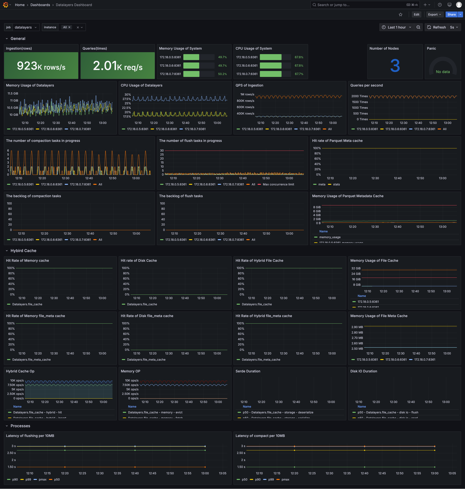

# 系统监控

## 概述

Datalayers 指标支持与 Prometheus 集成。Datalayers 启动后，您可以通过 HTTP 协议访问 `http://<服务地址>:8361/metrics` 获取系统实时指标数据。这些指标可通过 Prometheus 进行采集存储，并通过 Grafana 进行可视化展示。

本文介绍如何通过 Prometheus + Grafana 实现 Datalayers 指标可视化。

## 通过 Prometheus 收集数据

### 安装 Prometheus

如果您尚未安装，请前往 [Prometheus 官网](https://prometheus.io/download/) 下载并安装。

### 配置 Prometheus

安装完成后，手动配置 `prometheus.yml`，增加以下配置内容：

``` yml
global:
  scrape_interval: 5s
  scrape_timeout: 5s
  evaluation_interval: 1m

scrape_configs:
  - job_name: datalayers
    honor_timestamps: true
    scrape_interval: 5s
    scrape_timeout: 5s
    metrics_path: /metrics
    scheme: http
    follow_redirects: true
    enable_http2: true
    static_configs:
      # Your Datalayers HTTP Server address
      - targets: ["127.0.0.1:8361"]
```

**注意**：请确保配置中的 IP 地址和端口号与您的 Datalayers HTTP 服务器地址一致。

### 启动 Prometheus

1. 首先准备配置文件`prometheus.yml`，内容同上述文件相同

2. 通过以下命令启动 prometheus 的 docker 容器:

```bash
docker run --name my-prometheus -d \
  -v ./prometheus.yml:/etc/prometheus/prometheus.yml \
  --network host \
  prom/prometheus
```

Prometheus 启动完成后，会定时从 Datalayers 服务拉取并存储指标数据。

如果希望持久化存储这些数据，则使用 `-v` 参数挂载固定目录到 Prometheus 容器。

例如：

```text
-v /home/my/prometheus-data:/prometheus
```

## 配置 Grafana

### 安装 Grafana

如果您尚未安装 Grafana，请前往 [Grafana 官网下载页](https://grafana.com/grafana/download?pg=get&plcmt=selfmanaged-box1-cta1) 下载并安装。

### 启动 Grafana

``` bash
docker run --name my-grafana --network host grafana/grafana
```

### 登录 Grafana

启动后通过浏览器访问 Grafana，默认用户名/密码为：admin/admin。

### 添加 Prometheus 数据源

找到 Grafana 菜单 `Configuration - Data sources`，选择 Prometheus 分类，进入页面后填入 Prometheus Server 地址，根据需求填写其他配置，保存并通过测试后生效。

### 添加监控面板

添加 Prometheus 数据源后，可在 `Grafana - Dashboards` 手动添加指标面板，或通过 `Grafana - Dashboards - Import` 功能快速导入我们提供的 [Dashboard 模板](https://github.com/datalayers-io/datalayers-with-grafana/blob/main/grafana/datalayers-dashboard.json)。

以下为监控面板示意图：



## 下一步

- 想了解指标写入与协议兼容，请参考 [Datalayers Prometheus 协议兼容](../prometheus/overview.md)
- 想直接构建数据分析面板，请参考 [Datalayers 集成 Grafana 可视化指南](../integration/datalayers-with-grafana.md)
- 想调整服务参数和资源限制，请参考 [配置文件介绍](./datalayers-configuration.md)
