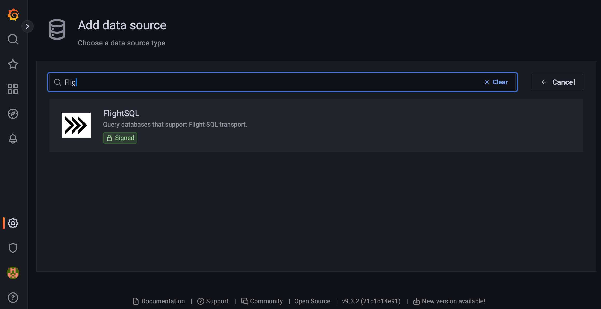

# Grafana
DataLayers 支持与开源数据可视化系统 Grafana 快速集成搭建数据监测仪表盘与告警系统，通过简单的配置，DataLayers 中的数据可以在仪表盘(DashBoard)上进行可视化展现。
## 准备工作

### 安装 DataLayers
使用 Docker 快速安装和启动 DataLayers
```SHELL
docker-compose ...
```

除 docker-compose 安装外， DataLayers 还支持多种安装方式，具体安装方法请参考 EMQX 5.0 安装指南。
更多参: [DataLayers 安装](../getting-started/installation.md)

### 安装 Grafana
**注：**  Grafana >=9.2.5
使用 Docker 快速安装和启动 Grafana：
```
docker run -d --name grafana -p 3000:3000 grafana/grafana
```

读者也可以参考 Grafana [官方文档](https://grafana.com/docs/grafana/latest/setup-grafana/installation/docker/)，下载和使用二进制包来安装和运行 Grafana。
当 Grafana 启动完成后，可以打开 http://localhost:3000 来访问 Grafana，如果能够正常访问到 Grafana 的登录页面，此时说明 Grafana 已经安装成功。


### 安装 Grafana 插件
在 Grafana Data Sources 中，添加  `FlightSQL` 插件，参见: [Grafana FlightSQL](https://grafana.com/grafana/plugins/influxdata-flightsql-datasource/)。
安装完毕后，在数据源中可搜索到 `FlightSQL`，如下图：


**注：** 安装完成后，需要重启 Grafana。


## 配置 FlightSQL


## 配置 Grafana Dashboard


