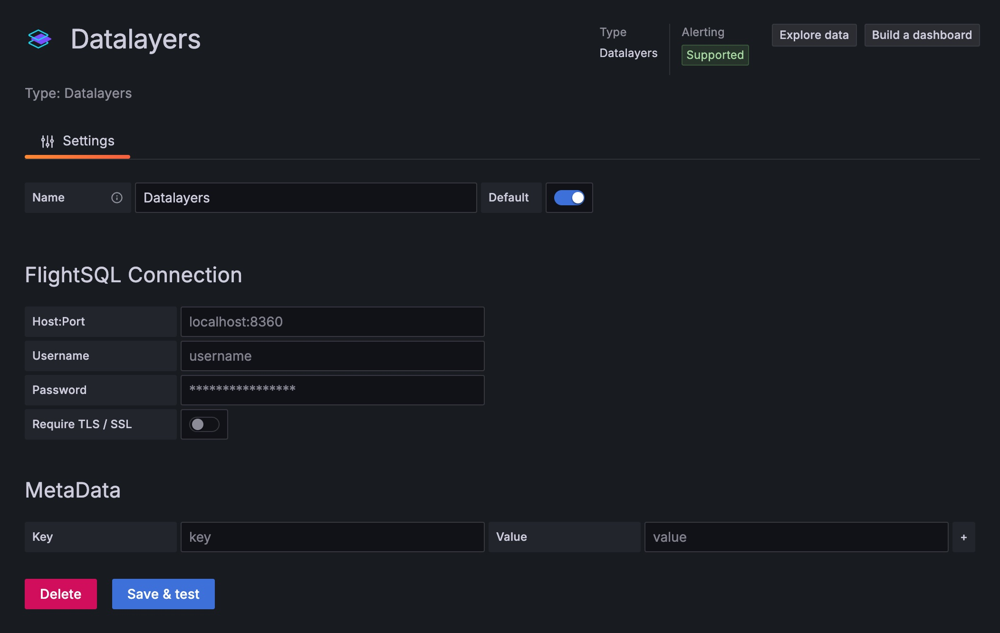

# Grafana
Datalayers 支持与开源数据可视化系统 Grafana 快速集成搭建数据监测仪表盘与告警系统，通过简单的配置，Datalayers 中的数据可以在仪表盘(DashBoard)上进行可视化展现。

若你想通过 docker compose 零配置快速体验，请点击[详情](https://github.com/datalayers-io/datalayers-with-grafana)查看。

## 安装 Datalayers

Datalayers 支持多种安装方式，具体安装方法请参考**快速开始**章节。


## 安装 Grafana

目前 Datalayers 支持 Grafana >=9.2.5 版本。请前往 [Grafana 官网下载页](https://grafana.com/grafana/download)。


## 安装并配置 Grafana 插件

安装好 Grafana 之后就可以进行插件的安装了，建议安装前先停止你的 grafana 服务。

:::: tabs

::: tab 手动安装插件
[下载](https://github.com/datalayers-io/grafana-flightsql-datasource/releases) Grafana 插件并解压到本地，例如 `./myplugins`。
编辑你的 `grafana.ini`，找到并修改如下配置：

```
[paths]
plugins = YOUR_UNZIP_DIRECTORY/myplugins

[plugins]
allow_loading_unsigned_plugins = datalayers
```

关于如何配置你的 `grafana.ini` ，可以参考 <a href="https://grafana.com/docs/grafana/latest/setup-grafana/configure-grafana/" target="_blank">Grafana 官网配置文档</a>，当然你也可以通过脚本安装的方式，为你自动安装插件并生成相关配置文件。

修改配置后，需要重启 grafana 服务。

打开浏览器，登录到 grafana

- 添加数据源

点击左侧菜单 `Connections - Data sources`, 然后点击 `Add new data source` 按钮, 找到 `Datalayers` 数据源:

 

- 配置数据源插件, 你可以点击 `Save & test` 按钮保存并测试连通性.



请注意：图中的 `http://datalayers:8360` 需要根据你 Datalayers 部署的地址、端口进行调整。
:::

::: tab 通过脚本安装

``` bash
bash -c "$(curl -fsSL \
  https://raw.githubusercontent.com/datalayers-io/grafana-flightsql-datasource/main/install.sh)" -- \
  -h localhost:8360 \
  -u admin \
  -p public

# 参数为 datalayers 连接相关配置：-h 为地址和端口， -u 为用户名，-p 为密码，请根据实际情况修改
```

该脚本将为你自动安装插件，并在当前目录生成相关配置文件，脚本运行结束后，请根据脚本提示，进入到你的 grafana 实例目录，启动 grafana 服务。
:::

::: tab 通过 docker 安装

首先需要[下载](https://github.com/datalayers-io/grafana-flightsql-datasource/releases) Grafana 插件并解压到本地，例如 `./myplugins`。

如果你希望单独通过 docker 来运行，请运行以下命令

``` bash
docker run \
  -v $PWD/plugins/datalayers:/var/lib/grafana/plugins/datalayers \
  -e GF_PLUGINS_ALLOW_LOADING_UNSIGNED_PLUGINS=datalayers \
  --network host \
  --name grafana-datalayers \
  grafana/grafana:latest
```

通过浏览器登录到 Grafana。

- 添加数据源

点击左侧菜单 `Connections - Data sources`, 然后点击 `Add new data source` 按钮, 找到 `Datalayers` 数据源:

 

- 配置数据源插件, 你可以点击 `Save & test` 按钮保存并测试连通性.


请注意：图中的网络地址 `http://datalayers:8360` 请替换为实际网络地址。这里 Docker 启动 Grafana 使用了 host 模式，若你希望通过端口映射来启动，请注意使用 Docker 容器内部能够访问的网络地址。

:::

::::


## 配置 Grafana Dashboard

现在，你可以按照你喜欢的方式配置 Grafana Dashboard，或者通过 Grafana Explore 进行一些查询。

例如：


::: tip
请注意，在 Grafana 插件中查询语句请通过 <db_name>.<table_name> 的方式来指定数据库。
:::
