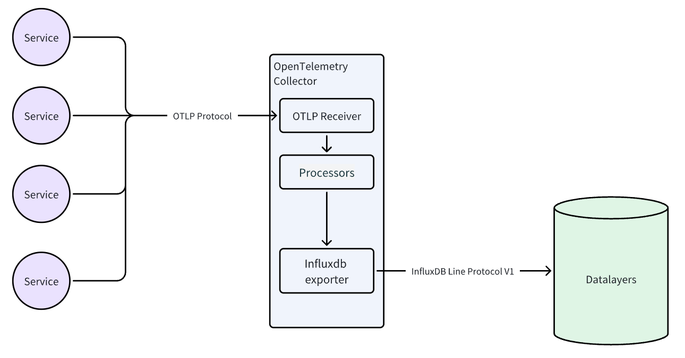

# OpenTelemetry
Datalayers 支持 InfluxDB 的行协议，因此可以通过 OpenTelemetry Collector 的 InfluxDB Exporter 插件与 Datalayers 实现集成。



## OpenTelemetry Collector
OpenTelemetry Collector 官方提供了 [Core](https://hub.docker.com/r/otel/opentelemetry-collector/tags)、 [Contrib](https://hub.docker.com/r/otel/opentelemetry-collector-contrib)   两个不同的版本。 其中前都只包基础的插件， 后都包含了所有的插件。Core 版本中没有 influxdb exporter 插件，而 Contrib 版本中有。也可以按需自己构建镜像， 只包含自己需要的插件， 建议生产环境采用这种方式， 参考：[Building a custom collector](https://opentelemetry.io/docs/collector/custom-collector)

InfluxDB Exporter 详细文档参考：[influxdb-exporter](https://github.com/open-telemetry/opentelemetry-collector-contrib/tree/main/exporter/influxdbexporter)

### 配置项说明


## 最简 OpenTelemetry Collector 配置示例

```yaml
receivers:
  otlp:
    protocols:
      grpc:
        endpoint: 0.0.0.0:4317
      http:
        endpoint: 0.0.0.0:4318
exporters:
  influxdb:
    endpoint: http://172.31.104.77:8361
    v1_compatibility:
      enabled: true
      db: demo
      username: admin
      password: public
service:
  extensions: []
  pipelines:
    traces:
      receivers: [otlp]
      processors: []
      exporters: [influxdb]
```

配置中 Exporter 的 endpoint 需要替换成自己的 Datalayers 地址。由于当前 Datalayers 默认只支持 v1 版本的 InfluxDB Line Protocol，所以需要将 v1_compatibility 设置为 true。要使用的数据库名称需要提前在 Datalayers 中创建。 在 receivers 中选择一个协议，比如 otlp，和协议对应的 endpoint 配置。 从 receivers 中收到的数据会被 processor 处理，这里没有配置，所以直接发送到 exporters， 即为 Datalayers。当 Datalayers 收到数据后，会根据配置的数据库名称，将数据写入到对应的数据库中， 如果没有对应的表， 则会自动创建(如果关闭了 Datalayers 的自动创建表功能， 则需要提前在 Datalayers 中创建表)。


