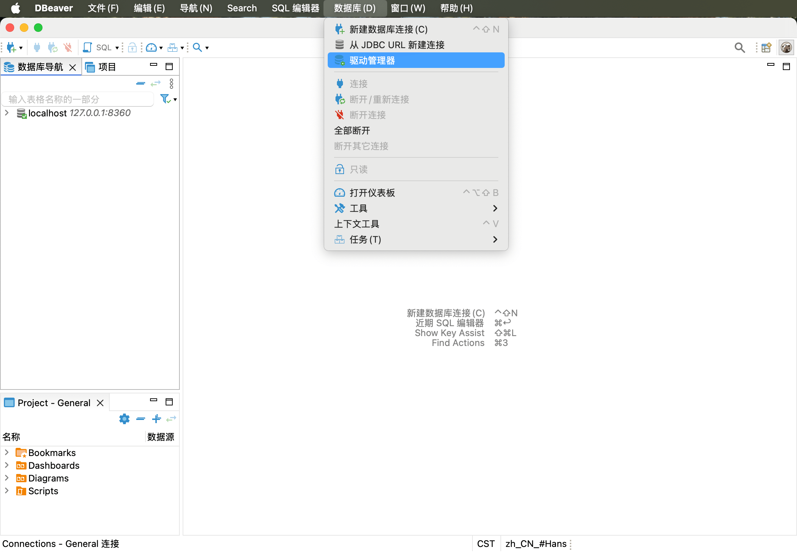
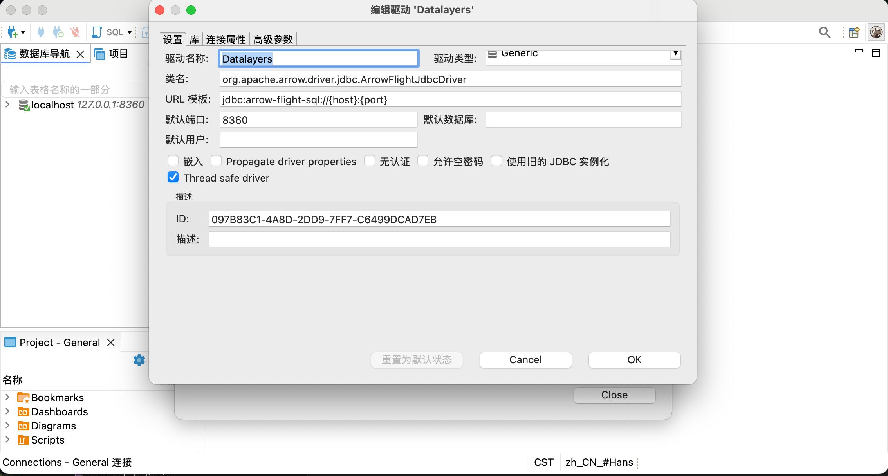
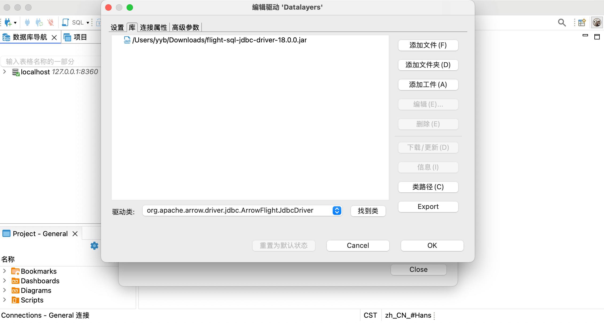
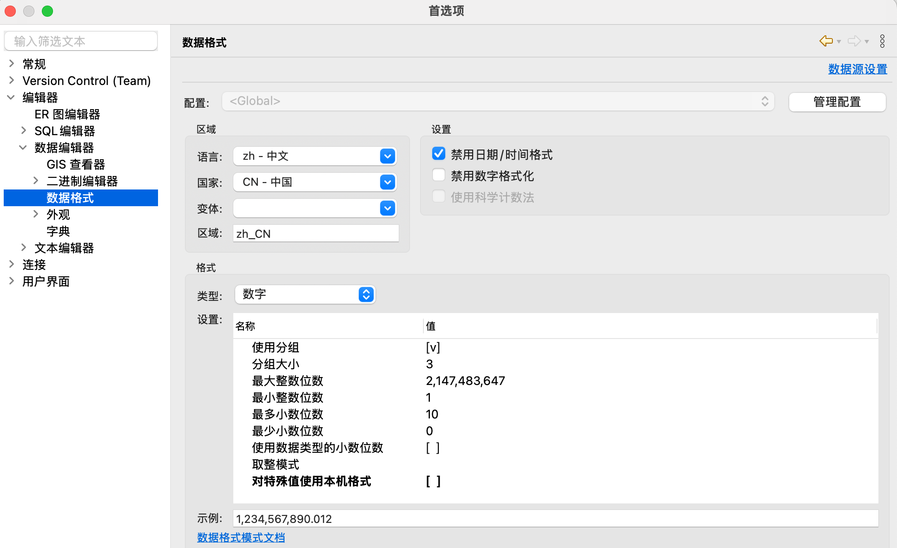
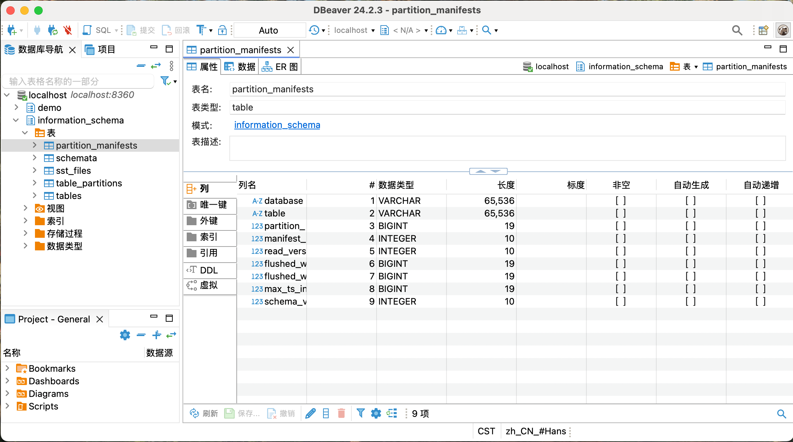

# Datalayers 集成 DBeaver 指南

[DBeaver](https://github.com/dbeaver/dbeaver) 是常用的开源数据库管理工具，适合用于连接、查询和管理多种数据库。从 Datalayers 2.2.4 开始，可以通过 Arrow Flight SQL JDBC 驱动在 DBeaver 中连接和管理 Datalayers。

该方案适用于希望使用图形化客户端浏览库表、执行 SQL、查看结果集和进行日常调试的场景。

## 前置条件

- 已安装 Datalayers，版本不低于 `v2.2.4`
- 已安装 DBeaver，可参考 [DBeaver 安装文档](https://github.com/dbeaver/dbeaver/wiki/Installation)
- 已下载 [Arrow Flight SQL JDBC Driver](https://mvnrepository.com/artifact/org.apache.arrow/flight-sql-jdbc-driver/18.3.0)
- 已获取 Datalayers 实例地址、端口、用户名和密码

## 配置 DBeaver

Datalayers 支持 Arrow Flight SQL 协议，因此可以通过在 DBeaver 中新增自定义驱动的方式完成接入。

1. 启动 DBeaver，在菜单中点击数据库，选择驱动管理器进行添加驱动，如下图

   

2. 进入驱动管理器界面，选择新建驱动
3. 在创建新驱动界面配置以下信息：
   - 驱动器名称：例如 `Datalayers`
   - 驱动器类型：选择 `Generic`
   - 类名：`org.apache.arrow.driver.jdbc.ArrowFlightJdbcDriver`
   - URL 模板：`jdbc:arrow-flight-sql://{host}:{port}?useEncryption=false`
   - 默认端口：`8360`，这是 Datalayers 默认的 Arrow Flight SQL 端口

   

4. 切换至 **库** 标签页，添加此前下载的 [Arrow Flight SQL JDBC Driver](https://mvnrepository.com/artifact/org.apache.arrow/flight-sql-jdbc-driver)，添加完成后点击“查找类”，再点击 **OK** 保存配置

   

5. 点击顶部菜单“窗口 > 首选项”，在左侧选择“编辑器 > 数据编辑器 > 数据格式”，勾选 **禁用日期/时间格式**，如下图

   

6. 点击 **应用并关闭**，完成 DBeaver 驱动配置

## 连接 Datalayers

1. 从顶部菜单中选择数据库、新建数据库连接
2. 搜索此前添加的驱动名称（如此前添加的 Datalayers），找到后双击该图标，进入配置界面
3. 配置地址、用户名与密码，点击 **Finish** 完成连接配置
4. 连接成功后，即可在左侧导航中浏览对象并执行 SQL 操作

## 相关文档

- 想了解命令行方式的连接与操作，请参考 [Datalayers 命令行工具 dlsql 使用指南](../getting-started/command-line-tool.md)
- 想了解 REST API 接入方式，请参考 [Datalayers HTTP REST API 接入指南](../development-guide/rest-api/overview.md)
