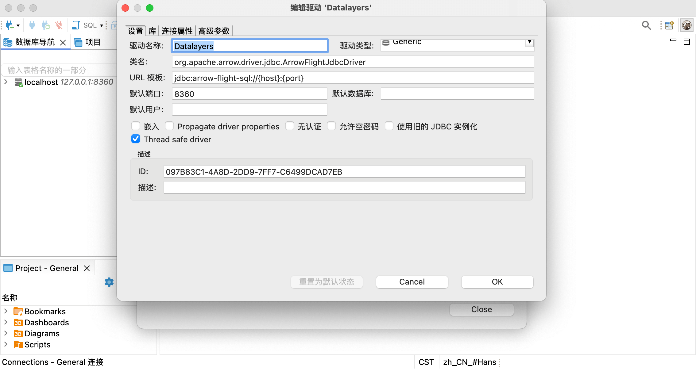
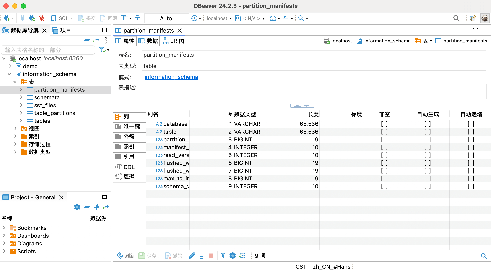

# DBeaver

[DBeaver](https://github.com/dbeaver/dbeaver) 是一款开源、跨平台的数据库管理工具，主要用于操作和管理各种数据库。从 Datalayers 2.2.4 版本开始，支持使用 DBeaver 工具对 Datalayers 进行操作、管理。

## 前置条件

* 已安装 Datalayers，版本 >= v2.2.4
* 已安装 DBeaver（本文以 v24.2.3.202410201725 进行讲解），安装方法参考：[DBeaver安装](https://github.com/dbeaver/dbeaver/wiki/Installation)
* 已下载 [ARROW Flight SQL JDBC DRIVER](https://mvnrepository.com/artifact/org.apache.arrow/flight-sql-jdbc-driver) 驱动程序（选择最新版即可）。

## 配置 DBeaver

Datalayers 支持 Arrow Flight SQL 协议，因此通过配置 DBeaver 插件即可实现通过 DBeaver 访问 Datalayers。通过以下几个步骤即可实现：

1. 启动 DBeaver，在菜单中点击数据库，选择驱动管理器进行添加驱动，如下图

2. 进入驱动管理器界面，选择新建驱动
3. 在创建新驱动器界面配置以下信息：  
    * 驱动器名称，填写一个容易记住的名字，如：Datalayers
    * 驱动器类型，选择：Generic
    * 类名填写：org.apache.arrow.driver.jdbc.ArrowFlightJdbcDriver
    * URL 模板：jdbc:arrow-flight-sql://{host}:{port}
    * 默认端口填写：8360。这是 Datalayers 默认的端口

4. 切换至 **库** 的标签页面，添加此前下载的 [Arrow Flight SQL 的 JDBC 驱动程序](https://mvnrepository.com/artifact/org.apache.arrow/flight-sql-jdbc-driver)，添加完成后点击查找类

5. 切换至 **连接属性** 的标签页面，添加属性：`useEncryption`， 值为：`false`
6. 点击 **OK** 保存配置，此时便完成了配置

## 连接 Datalayers

1. 从顶部菜单中选择数据库、新建数据库连接
2. 搜索此前添加的驱动名称（如此前添加的 Datalayers），找到后双击该图标，进入配置界面
3. 配置地址、用户名与密码，点击 **Finish** 完成配置
4. 此时便完成了连接 Datalayers 的配置，点击左右实例，便可对数据库进行相应操作

