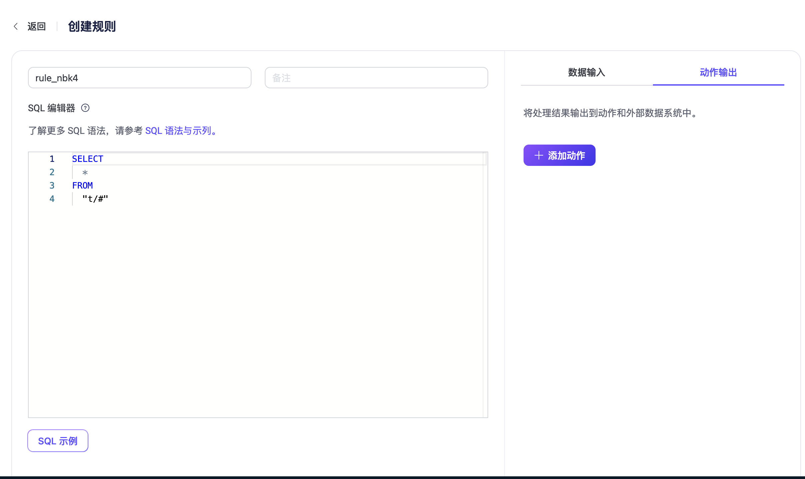
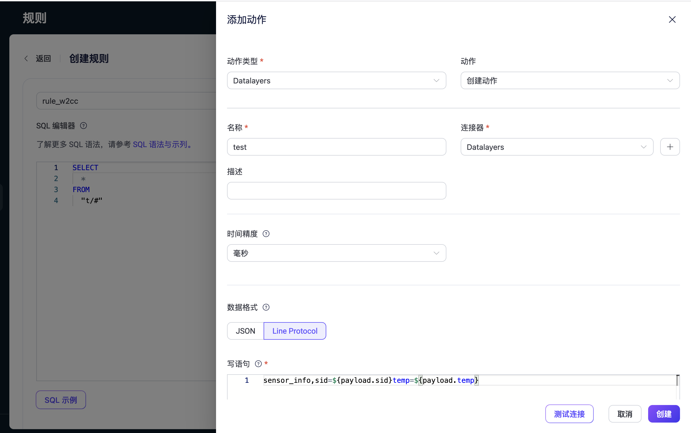
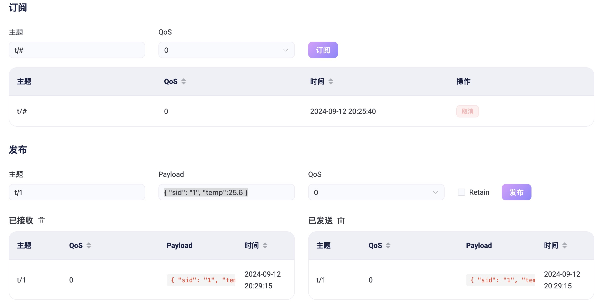

# 通过 EMQX 实现数据写入

[EMQX](https://www.emqx.com/en) 是一款高度可扩展、高性能的开源 MQTT 消息代理（Message Broker），用于处理海量物联网设备的消息通信。它是基于 Erlang/OTP 语言开发的，具有卓越的并发处理能力和稳定性。EMQX 主要应用于物联网（IoT）领域，帮助设备通过 MQTT 协议进行消息发布和订阅，广泛用于智慧城市、智能制造、车联网、能源管理等领域。

本章节介绍如何通过 EMQX 的规则引擎数据数据存储到 Datalayers 中。

## 前置条件
1. 已安装 Datalayers, 版本要求：>= 2.1.8。
2. 已安装 EMQX 企业版，版本要求：>= 5.8。

## 配置步骤

### 配置 Datalayers 
向 Datalayers 中写入数据，需提前创建 `database` 与 `table`，可使用 Datalayers 命令行工具 `dlsql` 来进行创建。

```sql
> create database demo
Query OK, 0 rows affected. (0.001 sec)

> use demo
Database changed to `demo`

> CREATE TABLE `sensor_info` (
  time TIMESTAMP(9) NOT NULL,
  sid STRING NOT NULL,
  temp DOUBLE,
  timestamp key(time))
  PARTITION BY HASH (sid) PARTITIONS 1 
  ENGINE=TimeSeries
Query OK, 0 rows affected. (0.034 sec)

```


### 配置 EMQX
#### 创建连接器
- 登录 EMQX 管理控制台
- 左侧菜单导航致至 `集成` > `连接器`
- 点击 "创建"，在搜索框中输入 `Datalayers`，在搜索结果中选择 **Datalayers**, 点击下一步
- 填写 **Datalayers** 连接信息，填写完成后可点击**测试连接**，确保连接成功，如下图：

```
注：服务器通讯地址填写 `Datalayers HTTP 地址` 
```
- 点击`创建`，保存资源配置

#### 创建规则
- 在左侧菜单导航 `集成` > `规则` 页面，在左侧 SQL 编辑器中填写相应的 SQL 规则，点击右侧 `创建`。如下图：
  
- 在创建规则页面填写相应连接器信息、数据模板。如下图：
  
  在`写语句`的编辑器中，写入相应的语句模板。
- 在右下角点击创建，以保存动作
- 在创建规则页面，点击`保存`  
```
此时，经过以上几步实现了使用 EMQX 规则引擎将数据写入到 Datalayers 中。
```
## 数据写入示例
通过以上配置后，我们通过向 EMQX 发布消息（topic以 `t/` 开头），相应的数据就会自动保存到 Datalayers 中。我们使用 EMQX Dashboard 中提供的问题分析工具 > WebSocket 客户端来演示说明。

- 在右边连接配置中，确保相应配置信息正常，点击连接，确保成功连接到 MQTT Broker
- 在订阅栏中，主题框中输入 `t/#` 进行通配订阅，方便后续观察
- 在发布窗口中，主题框输入`t/1`，Payload 框中输入 `{ "sid": "1", "temp":25.6 }`，点击发布，此时我们将看到 pub 与 sub 的消息，如下：
  
```
此时，说明已经成功将数据 pub 到了 MQTT Broker 中。
```
- 使用 Datalayers dlsql 命令行工具查看写入的数据
```sql
demo> select * from sensor_info;
+-------------------------------+-----+------+
| time                          | sid | temp |
+-------------------------------+-----+------+
| 2024-09-12T20:26:58.804+08:00 | 1   | 25.6 |
| 2024-09-12T20:29:16.010+08:00 | 1   | 25.7 |
+-------------------------------+-----+------+
2 rows in set (0.001 sec)
```
