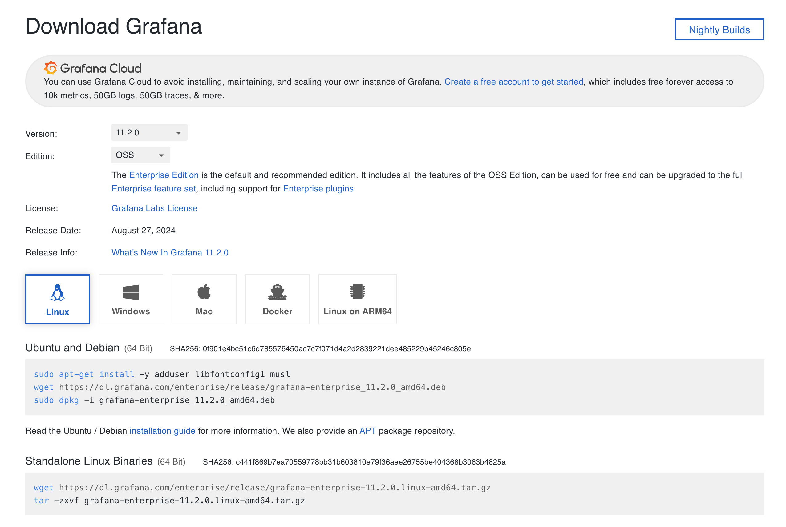
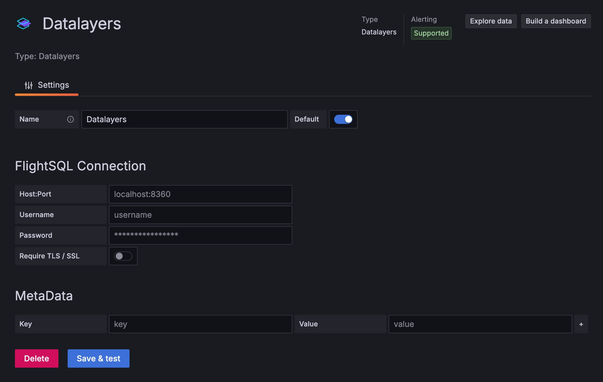
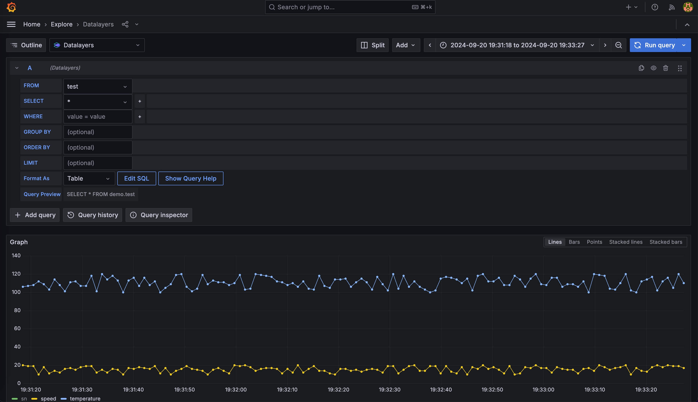
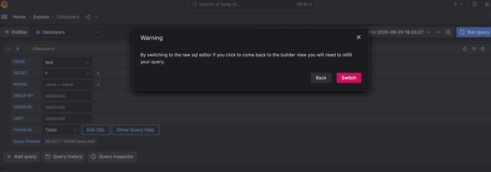
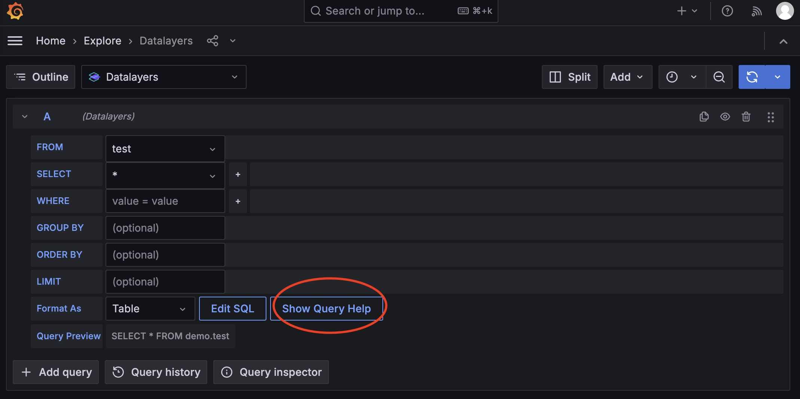
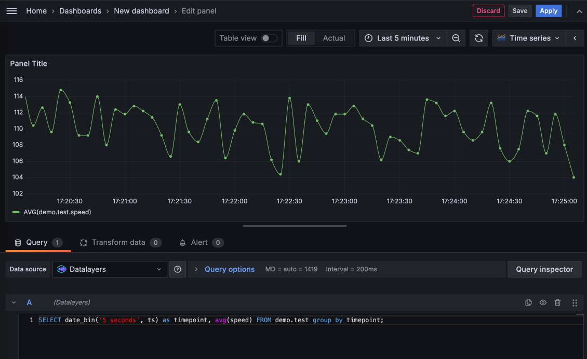

# Grafana

随着物联网 (IoT)、工业自动化、智能能源等领域的迅猛发展，数据量呈现爆炸式增长。如何高效管理这些时序数据并实现实时监控，已成为各行业面临的关键挑战。Datalayers 作为一款专为工业 IoT 和连接车辆等场景优化的时序数据库，提供了强大的分布式存储和计算能力。而通过与Grafana 的集成，用户可以将这些复杂的时序数据以可视化的形式呈现出来，帮助实现实时数据洞察。

本文将介绍如何将 Datalayers 与 Grafana 集成，以实现数据存储、可视化，以下是具体的集成步骤：
```
我们提供 **手动部署** 与 **Docker Compose 一键部署**，下面将分别介绍这两种部署方式。
```

## 手动部署

### 环境准备

- Grafana 版本必须 >= 9.2.5。

### 安装 Datalayers

Datalayers 支持多种安装方式，具体安装方法请参考**快速开始**章节。

此处我们以 Ubuntu 操作系统、amd64 平台为例，请至[下载页](https://datalayers.cn/download?broker=ubuntu)下载对应平台的 `deb` 安装包。

安装完成后，可以通过我们提供的命令行工具写入一些示例数据：

首先，通过以下命令连接到数据库：

``` bash
dlsql -u admin -p public
```

然后创建一个示例数据库：

``` bash
create database demo;
```

再创建一个表：

``` bash
CREATE TABLE demo.sensor_info (
  ts TIMESTAMP(9) NOT NULL DEFAULT CURRENT_TIMESTAMP,
  sn STRING,
  speed DOUBLE,
  temperature DOUBLE,
  timestamp KEY (ts))
  PARTITION BY HASH(sn) PARTITIONS 8
  ENGINE=TimeSeries
  with (ttl='10d');
```

写入一些示例数据，当然为了数据更丰富，你可以多写入一点随机数据：

``` bash
INSERT INTO sensor_info(sn, speed, temperature) VALUES('100', 22.12, 30.8), ('101', 34.12, 40.6), ('102', 56.12, 52.3);
```

- 关于更多 SQL 的支持，请查看[SQL参考](../sql-reference/data-type.md)。

- 关于命令行工具，更详细的用法请参考[命令行工具](../getting-started/command-line-tool.md)。


### 安装 Grafana

请前往 [Grafana 官网下载页](https://grafana.com/grafana/download)。

此处我们下载并安装 Linux 的 开源版本 11.2.0：




> 安装好 Grafana 之后就可以进行插件的安装了，建议安装前先停止你的 Grafana 服务。

### 安装 Datalayers 数据源插件

:::: tabs

::: tab 通过脚本安装

``` bash
bash -c "$(curl -fsSL \
  https://raw.githubusercontent.com/datalayers-io/grafana-datalayers-datasource/main/install.sh)" -- \
  -h localhost:8360 \
  -u admin \
  -p public

# 参数为 datalayers 连接相关配置：-h 为地址和端口， -u 为用户名，-p 为密码，请根据实际情况修改
```

该脚本将为你自动安装插件，并在当前目录生成相关配置文件，脚本运行结束后，请根据脚本提示，进入到你的 Grafana 实例目录，启动 Grafana 服务。
:::

::: tab 手动安装
下载[Grafana 插件](https://github.com/datalayers-io/grafana-datalayers-datasource/releases) 并解压到本地，例如 `./myplugins`。
编辑你的 `grafana.ini`，找到并修改如下配置：

```
[paths]
plugins = YOUR_UNZIP_DIRECTORY/myplugins

[plugins]
allow_loading_unsigned_plugins = datalayersio-datasource
```

修改配置后，需要重启 Grafana 服务。

打开浏览器，登录到 Grafana，通常是默认的 `3000` 端口。

- 添加数据源

点击左侧菜单 `Connections - Data sources`, 然后点击 `Add new data source` 按钮, 找到 `Datalayers` 数据源:

 

:::

::::


### 配置插件

此时 Grafana 和 Datalayers 数据源插件均已就绪，请通过本地浏览器，登录到 Grafana。

请按照下方图示填入对应的数据库地址+端口、用户名+密码，如果开启了 TLS 还需要填写证书。



> 推荐填写 metaData 部分，key 为 `'database'`，value 为 `'数据库名称'`，填写后在使用查询语句时可以免写数据库名。

配置完成后，你可以点击 `Save & test` 按钮保存并测试连通性。


### 数据查询

我们之前已经写入了一些示例数据，你可以通过 Datalayers 数据源插件进行一些查询。



图中使用 `Home - Explore` 面板查询数据，使用默认的界面模式试图拼出 `select * from demo.test` 这样的查询语句。

当然也可以切换到 SQL 编辑器模式，编写更复杂的查询语句。



你也可以使用`函数` 对数据进行聚合等操作，详见[SQL函数](../sql-reference/aggregation.html)。


在插件的编辑器模式中，你可以使用一些 Grafana 变量，请点击帮助按钮查看：




::: tip
请注意，在 Grafana 插件中查询语句建议通过 <db_name>.<table_name> 的方式来指定数据库。
:::


### 添加 Dashboard

现在，你也可以使用 `Grafana - Dashboards` 功能开始添加一个 Dashboard，如下图：



在此界面可进行更精细的调整，调整完成后可以点击 `Apply` 应用这个 `Panel`，当你添加了较多的 `Panel`，就可以通过 Grafana 强大的自定义编辑功能组合成一个丰富的 Dashboard。

## Docker Compose 一键部署

如果你想免去安装和配置 Datalayers 与 Grafana，可以通过我们提供的 docker compose 零配置快速体验。

首先你需要拉取这个[开源项目](https://github.com/datalayers-io/datalayers-with-grafana)。 它使用 Docker 将 Datalayers、Datalayers 对应的镜像整合到一个 docker-compose 文件中，这样可以快速启动这些服务。

``` bash
git clone https://github.com/datalayers-io/datalayers-with-grafana.git
```
然后请跟随 README 文档完成启动、快速写入示例数据的过程。

当你完成上述步骤后，就已经自动完成了上述所有的安装、配置、写入示例数据步骤，你可以直接进行数据查询、添加 Dashboard 相关操作。


## 结语
将 Datalayers 与 Grafana 集成，不仅能够大幅提升时序数据的管理与分析效率，还能通过灵活的可视化工具为用户提供更加直观的业务洞察。无论是在工业 IoT 还是智能能源等领域，Datalayers 与 Grafana 的结合都能帮助企业实现数据驱动的决策和优化，推动业务智能化转型。
