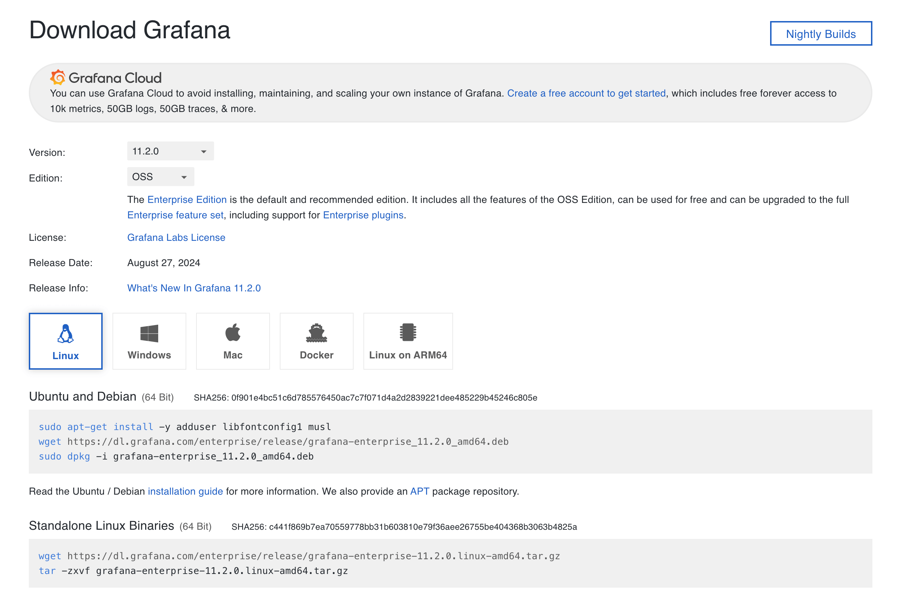
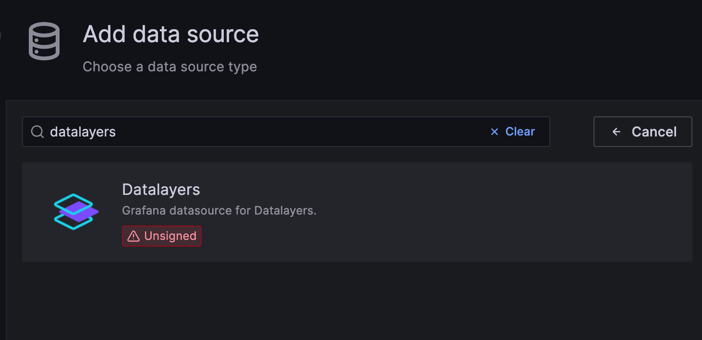
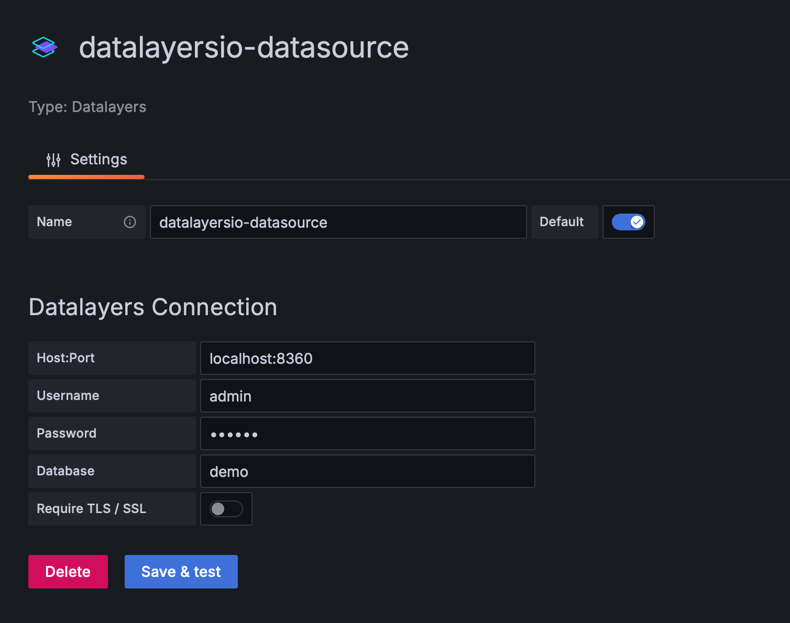
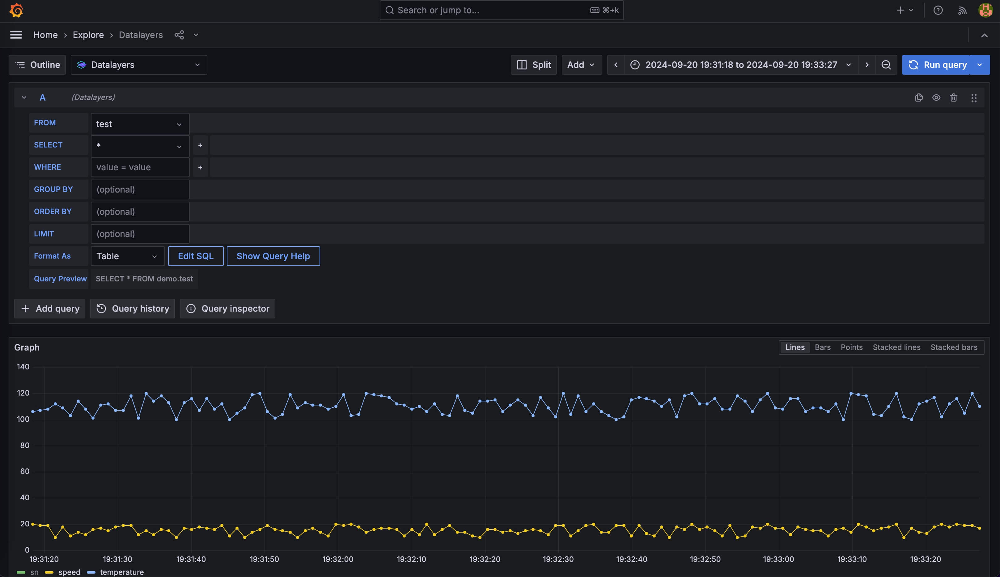
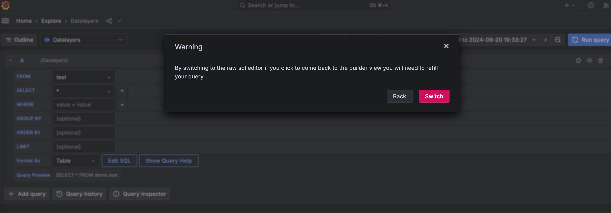
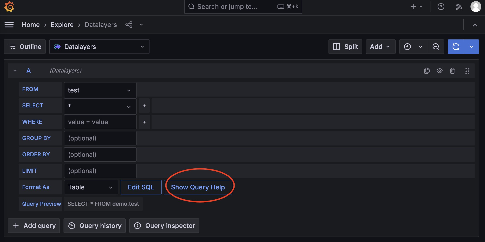
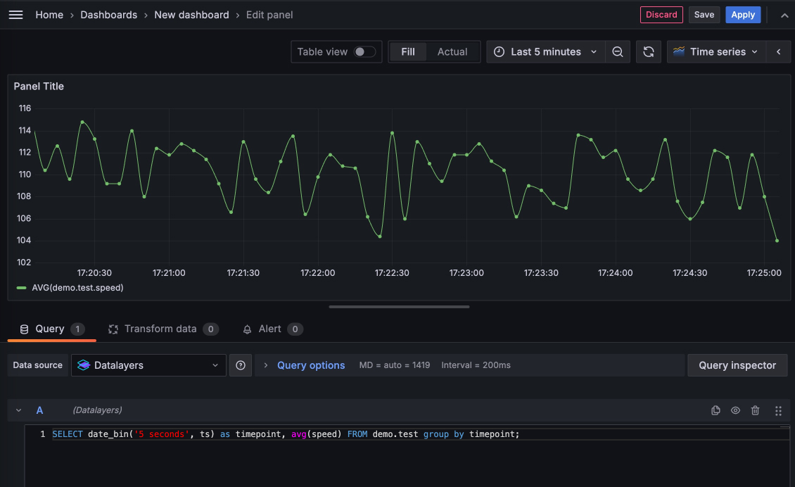

# Datalayers 集成 Grafana 可视化指南

本文介绍如何将 Datalayers 与 Grafana 集成，实现时序数据查询、可视化分析和 Dashboard 构建。该方案适用于监控看板、设备数据展示、工业指标分析等场景。

Datalayers 提供两种接入方式：

- 通过 PostgreSQL 数据源接入。
- 通过 Datalayers 数据源插件接入。

## 使用 PostgreSQL 数据源接入

Datalayers 兼容 PostgreSQL 协议，因此可以直接在 Grafana 中选择内置的 PostgreSQL 数据源并完成连接。

### 接入条件

- 已安装 Datalayers，并已启用 PostgreSQL 协议监听服务
- 已安装 Grafana，且可以正常访问 Grafana Web 界面
- 已获取 Datalayers 实例地址、PostgreSQL 协议端口、用户名和密码

### 配置方法

在 Grafana 中进入 Data sources 页面，新增 PostgreSQL 数据源后，填写 Datalayers 实例地址、端口、数据库名、用户名和密码。保存成功后，即可在 Grafana 中基于 SQL 查询创建图表与 Dashboard。

## 使用 Datalayers 插件接入

如果你希望在 Grafana 中获得更贴合 Datalayers 的使用体验，建议使用 Datalayers 数据源插件。以下步骤以 Ubuntu 和 amd64 平台为例进行说明。

### 环境准备

- Grafana 版本不低于 `9.2.5`
- 已安装 Datalayers，并可通过命令行工具访问实例
- 已获取 Datalayers 实例地址、端口、用户名和密码

### 准备示例数据

此处我们以 Ubuntu 操作系统、amd64 平台为例，请前往 [下载页](https://datalayers.cn/download?broker=ubuntu) 下载对应平台的 `deb` 安装包。

安装完成后，可以通过命令行工具写入一些示例数据，便于后续在 Grafana 中验证查询与可视化效果。

首先，通过以下命令连接到数据库：

``` bash
dlsql -h 127.0.0.1 -u admin -p public
```

然后创建一个示例数据库：

``` bash
create database demo;
```

切换到该数据库：

``` bash
use demo;
```

再创建示例表：

``` bash
CREATE TABLE sensor_info (
  ts TIMESTAMP(9) NOT NULL DEFAULT CURRENT_TIMESTAMP,
  sn STRING,
  speed DOUBLE,
  temperature DOUBLE,
  timestamp KEY (ts))
  PARTITION BY HASH(sn) PARTITIONS 8
  ENGINE=TimeSeries
  with (ttl='10d');
```

写入一些示例数据。为了便于观察图表变化，你也可以写入更多随机数据：

``` bash
INSERT INTO sensor_info(sn, speed, temperature) VALUES('100', 22.12, 30.8), ('101', 34.12, 40.6), ('102', 56.12, 52.3);
```

- 关于更多 SQL 的支持，请查看 [SQL 参考](../sql-reference/data-type.md)。

- 关于命令行工具，更详细的用法请参考 [Datalayers 命令行工具 dlsql 使用指南](../getting-started/command-line-tool.md)。

### 安装 Grafana

请前往 [Grafana 官网下载页](https://grafana.com/grafana/download) 获取安装包。



> 建议在安装插件前先停止 Grafana 服务，完成安装后再重新启动。

### 安装 Datalayers 数据源插件

:::: tabs

::: tab 通过脚本安装

``` bash
bash -c "$(curl -fsSL \
  https://raw.githubusercontent.com/datalayers-io/grafana-datalayers-datasource/main/install.sh)" -- \
  -h localhost:8360 \
  -u admin \
  -p public

# 参数为 Datalayers 连接相关配置：`-h` 为地址和端口，`-u` 为用户名，`-p` 为密码，请根据实际情况修改
```

该脚本会自动安装插件，并在当前目录生成相关配置文件。脚本执行完成后，请根据终端提示进入 Grafana 实例目录并启动 Grafana 服务。
:::

::: tab 手动安装

- 下载 [Grafana 插件](https://github.com/datalayers-io/grafana-datalayers-datasource/releases) 并解压到本地目录，例如 `./myplugins`。
- 编辑 `grafana.ini`，找到并修改如下配置：

```ini
[paths]
plugins = YOUR_UNZIP_DIRECTORY/myplugins

[plugins]
allow_loading_unsigned_plugins = datalayersio-datasource
```

- 保存配置并重启 Grafana 服务。

- 打开浏览器并登录到 Grafana，默认访问地址通常为 `http://127.0.0.1:3000`。

- 在左侧菜单中进入 `Connections > Data sources`，点击 `Add new data source`，然后搜索并选择 `Datalayers` 数据源。



:::

::::

### 配置插件

此时 Grafana 和 Datalayers 数据源插件均已就绪，请在浏览器中登录 Grafana，并完成数据源配置。

请按照下方图示填写数据库地址和端口、用户名和密码，以及默认数据库名称；如果实例开启了 TLS，还需要补充证书相关配置。



配置完成后，点击 `Save & test` 验证连通性。若测试失败，请优先检查实例地址、端口、认证信息以及 Grafana 与 Datalayers 之间的网络是否连通。

### 数据查询

前面已经写入了示例数据，此时可以通过 Datalayers 数据源插件执行查询。



图中使用 `Home > Explore` 面板查询数据。在默认可视化构建模式下，可以自动生成类似 `select * from demo.sensor_info` 的查询语句。

如果需要更复杂的分析逻辑，也可以切换到 SQL 编辑器模式，自行编写查询语句。



你也可以结合聚合函数进行统计分析，详见 [SQL 函数](../sql-reference/aggregation.md)。

在插件编辑器模式中，还可以使用 Grafana 变量。可点击帮助按钮查看变量说明与用法：



::: tip
在 Grafana 插件中，建议通过 `数据库名.表名` 的形式引用对象，例如 `demo.sensor_info`，以避免默认数据库切换带来的歧义。
:::

### 添加 Dashboard

完成查询验证后，即可在 Grafana 中创建 Dashboard，如下图所示：



在该界面中，你可以进一步调整查询语句、时间范围、图表类型和显示样式。单个 Panel 调整完成后点击 `Apply` 保存；当添加多个 Panel 后，即可组合出完整的业务监控或设备分析 Dashboard。

## 相关文档

- 如果你还没有准备测试数据，请参考 [Datalayers 命令行工具 dlsql 使用指南](../getting-started/command-line-tool.md)
- 如果你希望使用图形化数据库工具排查查询结果，请参考 [Datalayers 集成 DBeaver 使用指南](./datalayers-with-dbeaver.md)
- 如果你需要进一步了解聚合查询与 SQL 能力，请参考 [SQL 参考](../sql-reference/data-type.md)
