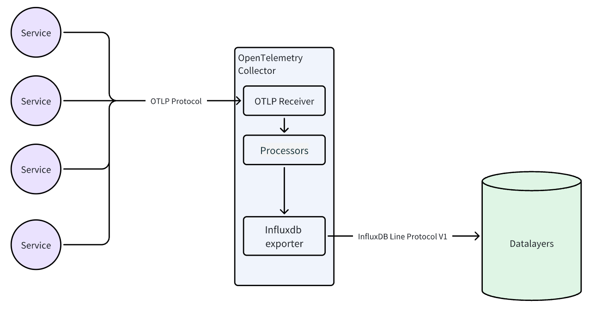

# Datalayers 集成 OpenTelemetry 指南

Datalayers 支持 InfluxDB Line Protocol，因此可以通过 OpenTelemetry Collector 的 InfluxDB Exporter 将指标、链路等观测数据写入 Datalayers。该方案适用于统一接入 OpenTelemetry 采集链路，并将数据存入 Datalayers 进行后续分析和存储。



## OpenTelemetry Collector

OpenTelemetry Collector 官方提供 [Core](https://hub.docker.com/r/otel/opentelemetry-collector/tags) 和 [Contrib](https://hub.docker.com/r/otel/opentelemetry-collector-contrib) 两个版本。Core 仅包含基础插件，Contrib 包含更完整的插件集。由于 Core 不包含 `influxdb exporter`，而 Contrib 包含该插件，因此接入 Datalayers 时通常优先选择 Contrib 版本。

如果需要更精简的生产镜像，也可以按需自定义构建 Collector，仅保留必要插件。参考：[Building a custom collector](https://opentelemetry.io/docs/collector/custom-collector)

InfluxDB Exporter 详细文档参考：[influxdb-exporter](https://github.com/open-telemetry/opentelemetry-collector-contrib/tree/main/exporter/influxdbexporter)

### 配置项说明

The following configuration options are supported:

* `endpoint` (required) HTTP/S destination for line protocol
  * if path is set to root (/) or is unspecified, it will be changed to /api/v2/write.
* `timeout` (default = 5s) Timeout for requests
* `headers`: (optional) additional headers attached to each HTTP request
  * header `User-Agent` is `OpenTelemetry -> Influx` by default
  * if `token` (below) is set, then header `Authorization` will overridden with the given token
* `org` (required) Name of InfluxDB organization that owns the destination bucket
* `bucket` (required) name of InfluxDB bucket to which signals will be written
* `token` (optional) The authentication token for InfluxDB
* `v1_compatibility` (optional) Options for exporting to InfluxDB v1.x
  * `enabled` (optional) Use InfluxDB v1.x API if enabled
  * `db` (required if enabled) Name of the InfluxDB database to which signals will be written
  * `username` (optional) Basic auth username for authenticating with InfluxDB v1.x
  * `password` (optional) Basic auth password for authenticating with InfluxDB v1.x
* `span_dimensions` (default = service.name, span.name) Span attributes to use as dimensions (InfluxDB tags)
* `log_record_dimensions` (default = service.name) Log Record attributes to use as dimensions (InfluxDB tags)
* `payload_max_lines` (default = 10_000) Maximum number of lines allowed per HTTP POST request
* `payload_max_bytes` (default = 10_000_000) Maximum number of bytes allowed per HTTP POST request
* `metrics_schema` (default = telegraf-prometheus-v1) The chosen metrics schema to write; must be one of:
  * `telegraf-prometheus-v1`
  * `telegraf-prometheus-v2`
* `sending_queue` [details here](https://github.com/open-telemetry/opentelemetry-collector/blob/v0.25.0/exporter/exporterhelper/README.md#configuration)
  * `enabled` (default = true)
  * `num_consumers` (default = 10) The number of consumers from the queue
  * `queue_size` (default = 1000) Maximum number of batches allowed in queue at a given time
* `retry_on_failure` [details here](https://github.com/open-telemetry/opentelemetry-collector/blob/v0.25.0/exporter/exporterhelper/README.md#configuration)
  * `enabled` (default = true)
  * `initial_interval` (default = 5s) Time to wait after the first failure before retrying
  * `max_interval` (default = 30s) Upper bound on backoff interval
  * `max_elapsed_time` (default = 120s) Maximum amount of time (including retries) spent trying to send a request/batch

详见 [influxdb-exporter configuration](https://github.com/open-telemetry/opentelemetry-collector-contrib/blob/main/exporter/influxdbexporter/README.md)。

## 最简 OpenTelemetry Collector 配置示例

```yaml
receivers:
  otlp:
    protocols:
      grpc:
        endpoint: 0.0.0.0:4317
      http:
        endpoint: 0.0.0.0:4318
exporters:
  influxdb:
    endpoint: http://172.31.104.77:8361
    v1_compatibility:
      enabled: true
      db: demo
      username: admin
      password: public
service:
  extensions: []
  pipelines:
    traces:
      receivers: [otlp]
      processors: []
      exporters: [influxdb]
```

## 配置说明

* `endpoint` 需要替换为实际的 Datalayers HTTP 地址
* 当前 Datalayers 默认以 InfluxDB v1 兼容方式接收 Line Protocol，因此需要开启 `v1_compatibility.enabled=true`
* 目标数据库需要提前在 Datalayers 中创建
* `receivers` 接收的数据会先经过 `processors`，再发送到 `exporters`，最终写入 Datalayers
* 如果目标表不存在，系统会根据配置自动建表；如果关闭了自动建表功能，则需要提前创建表结构

## 相关文档

* 想了解 InfluxDB 行协议写入方式，请参考 [使用 InfluxDB 行协议写入数据](../development-guide/writing-with-influxdb-line-protocol.md)
* 想了解 HTTP 接入方式，请参考 [Datalayers HTTP REST API 接入指南](../development-guide/rest-api/overview.md)
