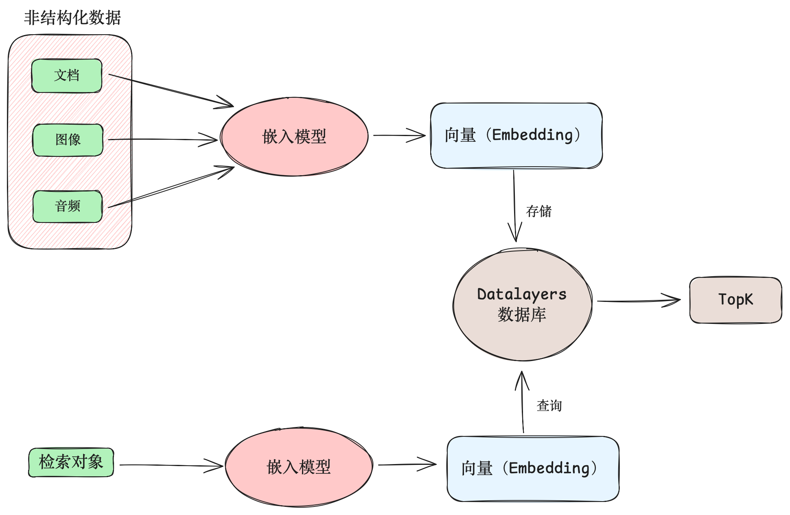

# 向量检索技术指南

## 概述
向量检索是一种针对非结构化数据的高效近似搜索技术。该技术将文档、图像、音频、视频等非结构化数据转换为向量嵌入（Vector Embedding）存储在数据库中，通过计算向量间的相似度来实现数据检索。

以电商搜索引擎业务为例，业务方使用嵌入模型（Embedding Model）将商品的名字、标签、描述、图片等统一转换为向量嵌入，存储到 Datalayers 等原生提供向量存储、向量检索的数据库中。用户在软件中搜索商品时，搜索词或图片被同一个嵌入模型转换为向量嵌入。软件后端将其作为目标向量，在数据库中进行检索。最终查找出与搜索词或图片最近似的一系列商品。

与传统的全文搜索不同，向量检索并不使用关键词进行精确或模糊匹配，而是用向量距离近似度量语义相似度，从而实现高效的近似检索。

## Datalayers 向量检索优势

| 特性              |   说明                                                               |  
| -------------     | ------------------------------------------------------------------- | 
| 原生向量类型       | 原生提供向量类型，支持高压缩率向量存储、高性能向量检索                   | 
| 丰富的索引        | 丰富的索引类型，以满足各种应用场景                                      | 
| 混合检索           | 支持向量检索、以及向量检索与标量检索的混合检索                          |
| 简单易用          | 原生 SQL 支持，兼容 MySQL 方言                                         |
| 多模态            |  提供时序、关系、流计算、日志等引擎，快速集成向量检索至任何业务场景        |
| 存算分离          |  计算和存储节点解耦，均可无限水平扩展，支持海量向量数据的存储和搜索        |
| 分布式            |  采用分布式架构，提供完备的容灾、备份、恢复策略                          |

## 核心概念

### 向量

数学意义上的向量是一个浮点数数组，形似 `[1.0, 2.0, 3.0]`。在向量检索领域，一个向量是一个物体在高维空间的嵌入表征（Embedding）。例如在一个由若干个图片构成的高维空间中，每个向量代表一张图片。

为了得到一个物体在某个高维空间的嵌入表征，我们使用嵌入模型（Embedding Model）对物体进行转换，得到一个高维向量。
常用的嵌入模型类型包括图像嵌入模型、文本嵌入模型等，分别可以将图像、文本转换为高维向量。

### 向量距离

向量距离是两个向量在高维空间的距离。在向量检索应用中，它用来近似度量两个向量的语义相似度。例如给定三张图片，分别表示“游泳”、“太阳”、“水”。
从语义上来说，“游泳”与“水”在语义上更接近，因此它们所对应的向量的距离更小。

## 应用场景

### 增强生成

增强生成（Retrieval-Augmented Generation，RAG）是一个用来优化大语言模型（LLM）输出效果的框架。RAG 将知识输入到嵌入模型中，得到知识的向量表征，再将它们存储到向量数据库中。在大语言模型根据用户输入的提示词（Prompt）生成提示时，RAG 将提示词转换为向量表征，在向量数据库中执行近似搜索，得到与提示词语义相近的文档。这些文档可以用来提升模型输出的效果，使得响应更准确。

### 语义搜索

通过使用合适的嵌入模型，任意非结构化数据均可以转换为统一的向量表征。因此向量搜索原生支持跨语言、跨模态（文本、图像、音频等）的搜索，支持基于语义的匹配。

### 推荐系统

推荐系统一方面将内容、商品等转换为向量表征，存储到向量数据库中。另一方面，在用户搜索内容或商品时，推荐系统将用户的历史行为、偏好、标签、好友关系、关注列表等信息转换为向量表征，在向量数据库中查找与之相似的一系列内容或商品，从而提供用户可能更感兴趣的内容或商品。
