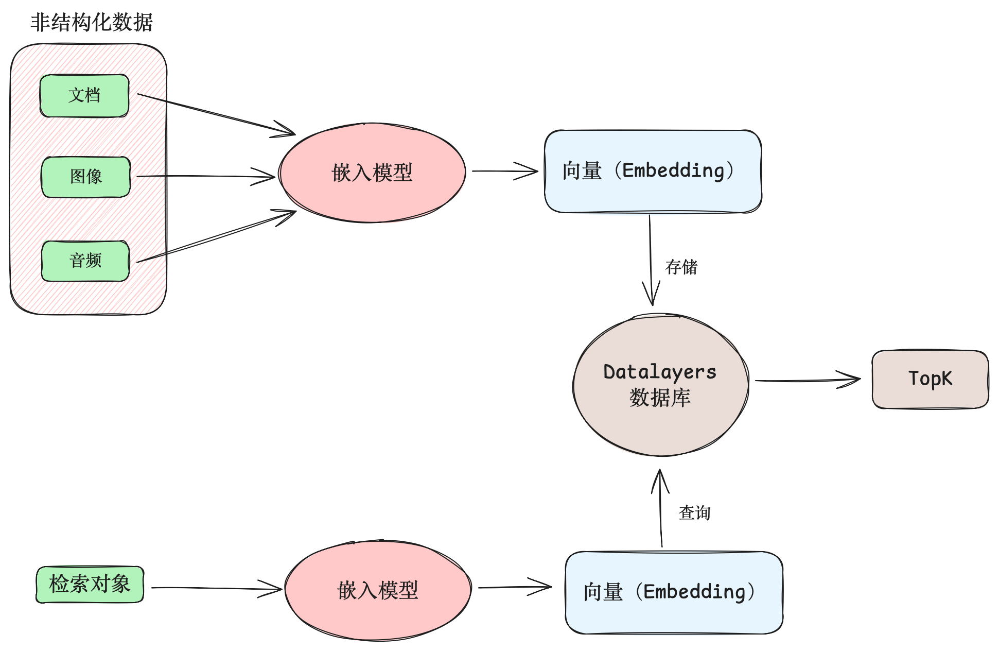

# Datalayers 向量检索概述

向量检索是一种面向非结构化数据的相似度搜索技术，也常被称为语义检索、相似度检索或 ANN 检索。它将文本、图像、音频、视频等对象编码为向量嵌入，再通过向量距离计算检索与目标最相近的数据。该能力常用于 RAG、语义搜索、推荐系统和多模态检索。

以电商搜索引擎业务为例，业务方使用嵌入模型（Embedding Model）将商品的名字、标签、描述、图片等统一转换为向量嵌入，存储到 Datalayers 等原生提供向量存储、向量检索的数据库中。用户在软件中搜索商品时，搜索词或图片被同一个嵌入模型转换为向量嵌入。软件后端将其作为目标向量，在数据库中进行检索。最终查找出与搜索词或图片最近似的一系列商品。

与传统的全文检索不同，向量检索并不依赖关键词匹配，而是通过向量距离近似度量语义相似度，因此更适合处理语义召回与跨模态搜索。

## Datalayers 向量检索优势

| 特性 | 说明 |
| --- | --- |
| 原生向量类型 | 原生提供向量类型，支持高压缩率向量存储、高性能向量检索 |
| 丰富的索引 | 支持 IVF、HNSW 等多种向量索引算法，以平衡召回效果与查询性能 |
| 混合检索 | 支持向量检索与标量条件组合使用，便于先过滤后召回 |
| 简单易用 | 原生 SQL 支持，兼容 MySQL 方言 |
| 多模态 | 提供时序、关系、流计算、日志等引擎，快速集成向量检索至任何业务场景 |
| 存算分离 | 计算和存储节点解耦，均可无限水平扩展，支持海量向量数据的存储和搜索 |
| 分布式 | 采用分布式架构，提供完备的容灾、备份、恢复策略 |

## 核心概念

### 向量

数学意义上的向量是一个浮点数数组，形似 `[1.0, 2.0, 3.0]`。在向量检索领域，一个向量是一个物体在高维空间的嵌入表征（Embedding）。例如在一个由若干个图片构成的高维空间中，每个向量代表一张图片。

为了得到一个物体在某个高维空间的嵌入表征，我们使用嵌入模型（Embedding Model）对物体进行转换，得到一个高维向量。
常用的嵌入模型类型包括图像嵌入模型、文本嵌入模型等，分别可以将图像、文本转换为高维向量。

### 向量距离

向量距离是两个向量在高维空间的距离。在向量检索应用中，它用来近似度量两个向量的语义相似度。例如给定三张图片，分别表示“游泳”、“太阳”、“水”。
从语义上来说，“游泳”与“水”在语义上更接近，因此它们所对应的向量的距离更小。

## 向量检索与全文检索的关系

向量检索擅长处理语义相似度问题，全文检索擅长处理关键词、短语和布尔表达式匹配。实际生产环境中，两者通常会结合使用：先通过结构化条件缩小范围，再通过向量检索召回候选结果，必要时叠加全文条件提升可解释性和准确性。

## 应用场景

### 检索增强生成

增强生成（Retrieval-Augmented Generation，RAG）是一个用来优化大语言模型（LLM）输出效果的框架。RAG 将知识输入到嵌入模型中，得到知识的向量表征，再将它们存储到向量数据库中。在大语言模型根据用户输入的提示词（Prompt）生成提示时，RAG 将提示词转换为向量表征，在向量数据库中执行近似搜索，得到与提示词语义相近的文档。这些文档可以用来提升模型输出的效果，使得响应更准确。

### 语义搜索

通过使用合适的嵌入模型，任意非结构化数据均可以转换为统一的向量表征。因此向量搜索原生支持跨语言、跨模态（文本、图像、音频等）的搜索，支持基于语义的匹配。

### 推荐系统

推荐系统一方面将内容、商品等转换为向量表征，存储到向量数据库中。另一方面，在用户搜索内容或商品时，推荐系统将用户的历史行为、偏好、标签、好友关系、关注列表等信息转换为向量表征，在向量数据库中查找与之相似的一系列内容或商品，从而提供用户可能更感兴趣的内容或商品。

## 相关文档

- 想快速体验向量写入和相似度查询，请参考 [向量检索快速开始](./quick-start.md)
- 想了解向量索引创建与使用方式，请参考 [向量索引](./vector-index.md)
- 想查看可用距离函数和检索函数，请参考 [向量函数](../sql-reference/vector-functions.md)
