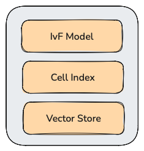

# 向量索引

向量索引用于加速向量检索，适合针对大规模向量数据集的快速查询。Datalayers 目前支持 FLAT、IVF_FLAT、IVF_PQ 等索引，IVF_SQ、HNSW 等更多索引正在开发中。

使用向量索引会带来额外的构建索引开销、检索开销，同时可能会降低召回率（recall），因此需要根据具体场景选择合适的索引、以及配置合适的参数。

## 向量索引模型

Datalayers 使用三层式结构对主流的向量索引进行统一建模。



### IVF Model

IVF（Inverted File）模型指质心 -> 向量组的倒排索引。在构建向量索引时，我们首先利用 K-Means 聚簇算法将向量数据集分成若干个向量组，每个向量组存在一个质心（Centroid）。IVF 模型维护了每个质心与其所在向量组的映射关系。

### Cell Index

我们将每一个向量组称为一个 Cell，该名称延用知名向量检索库 Faiss 中的命名。Datalayers 支持给向量组内的向量构建索引，称为 Cell Index，以加速向量组内的近似最近邻搜索。例如，当我们使用 HNSW 向量索引时，我们会为每个向量组构建一个图索引，利用图数据结构来加速检索。

### Vector Store

Vector Store 是向量的存储抽象。为了节省存储空间，我们支持对向量进行量化。量化指将原始向量投影到另一个更紧凑的向量空间，以达到数据压缩的目的。主流的量化算法包括乘积量化（PQ）、标量量化（SQ）等，它们均是有损、不可逆的量化算法，因此在搜索时会降低召回率。

## 基于索引的向量检索

基于索引的三层式结构，Datalayers 的向量检索分成如下步骤：

1. 模糊搜索：给定查询向量 Q，我们首先访问 IVF Model，计算 Q 与所有质心的距离，并取最近的 P 个质心所对应的向量组。
2. 精确搜索：对于每个向量组，我们使用 Cell Index 加速向量组内的近似最近邻搜索，每个质心得到 top-N 个与 Q 距离最近的向量。
3. Refine：考虑到向量索引会降低召回率，对于搜索得到的 `P * N` 个向量，计算它们与 Q 的距离，得到最终的 top-K 个距离最近的向量。其中 `N / K` 称为 `refine_factor`，表示为了补偿召回率，我们在精确搜索时多检索了多少向量。

## 索引类型

|               |  IVF Model       | Cell Index  | Vector Store | 是否已支持 |
| :-----        | :----------:     | :---------: | :----------: | :-----: |
| FLAT          | Cell 个数固定为 1  | FLAT        | FLAT         |    是     |
| IVF_FLAT      | 支持配置 Cell 个数 | FLAT        | FLAT         |    是     |
| IVF_PQ        | 支持配置 Cell 个数 | FLAT        | PQ           |    是     |
| IVF_SQ        | 支持配置 Cell 个数 | FLAT        | SQ           |      否     |
| IVF_RQ        | 支持配置 Cell 个数 | FLAT        | RQ       |      否     |
| HNSW          | Cell 个数固定为 1 | HNSW        | FLAT            |      否     |
| IVF_HNSW      | 支持配置 Cell 个数 | HNSW        | FLAT            |      否     |
| IVF_HNSW_PQ   | 支持配置 Cell 个数 | HNSW        | PQ            |      否     |

注：

- Cell Index 为 FLAT，表示不使用 Cell Index。
- Cell Index 为 HNSW，表示使用 HNSW（Hierarchical Navigable Small Worlds）索引作为 Cell Index。
- Vector Store 为 FLAT，表示不使用任何量化算法，而存储原始、未经压缩的向量。
- PQ 指 Product Quantization，即乘积量化。
- SQ 指 Scalar Quantization，即标量量化。
- RQ 指 RaBit Quantization。

## 示例

创建一个表，包含一个向量列，为该向量列指定 IVF_PQ 索引，同时指定构建索引的距离函数为 L2。

``` sql
CREATE DATABASE IF NOT EXISTS `demo`;

CREATE TABLE `demo`.`t` (
  `ts` TIMESTAMP(3) NOT NULL DEFAULT CURRENT_TIMESTAMP,
  `sid` INT32 NOT NULL,
  `value` REAL,
  `flag` INT8,
  `embed` VECTOR(64),
  TIMESTAMP KEY(`ts`),
  VECTOR INDEX `my_vector_index`(`embed`) WITH (TYPE=IVF_PQ, DISTANCE=L2)
) 
PARTITION BY HASH (`sid`) PARTITIONS 2
ENGINE=TimeSeries
WITH (
  MEMTABLE_SIZE=1024MB,
  STORAGE_TYPE=LOCAL,
  UPDATE_MODE=APPEND
);
```

使用以下脚本向该表写入一定规模的随机向量数据。

``` bash
#!/bin/bash

# 数据库和表信息
DATABASE="demo"
TABLE="t"

# 写入参数
TOTAL_ROWS=10000
BATCH_SIZE=1000
NUM_BATCHES=$((TOTAL_ROWS / BATCH_SIZE))

echo "开始向表 $DATABASE.$TABLE 写入 $TOTAL_ROWS 条数据..."
echo "批次大小: $BATCH_SIZE, 总批次: $NUM_BATCHES"

# 循环写入每个批次
for ((batch=0; batch<NUM_BATCHES; batch++)); do
    echo "正在写入第 $((batch+1)) 批次..."
    
    # 构建INSERT语句
    SQL="INSERT INTO $DATABASE.$TABLE (sid, value, flag, embed) VALUES "
    
    # 为当前批次构建VALUES子句
    for ((i=0; i<BATCH_SIZE; i++)); do
        # 生成随机数据
        SID=$((RANDOM % 10000))           # sid: 0-9999随机
        VALUE=$(awk -v min=0 -v max=100 'BEGIN{srand(); print min+rand()*(max-min)}')  # value: 0-100随机实数
        FLAG=$((RANDOM % 2))              # flag: 0或1
        # embed: 生成64维随机向量，值在-1到1之间
        EMBED_VECTOR="["
        for ((j=0; j<64; j++)); do
            RAND_VAL=$(awk -v min=-1 -v max=1 'BEGIN{srand(); printf "%.6f", min+rand()*(max-min)}')
            EMBED_VECTOR+="$RAND_VAL"
            if [ $j -lt 63 ]; then
                EMBED_VECTOR+=","
            fi
        done
        EMBED_VECTOR+="]"
        
        # 添加当前行的VALUES
        SQL+="($SID, $VALUE, $FLAG, $EMBED_VECTOR)"
        
        # 如果不是最后一行，添加逗号
        if [ $i -lt $((BATCH_SIZE-1)) ]; then
            SQL+=","
        fi
    done
    
    # 执行SQL语句
    echo "执行SQL语句..."
    dlsql -e "$SQL"
    
    # 检查执行结果
    if [ $? -eq 0 ]; then
        echo "第 $((batch+1)) 批次写入成功"
    else
        echo "第 $((batch+1)) 批次写入失败"
        exit 1
    fi
    
    # 可选：批次间延迟，避免对系统造成过大压力
    sleep 1
done

echo "数据写入完成！总共写入 $TOTAL_ROWS 条数据"
```

其中，dlsql 为 Datalayers 的命令行工具。

手动执行数据刷盘（Flush），以确保触发索引构建。

``` sql
FLUSH TABLE demo.t;
```

等待一段时间，直到索引构建完成。Datalayers 会在终端打印日志，提示开始构建索引与索引构建完成。也可以通过 `SHOW TASKS` 命令检视当前正在执行、被挂起的索引构建任务。

``` sql
> show tasks

+-------------+---------+---------+-------------------+-------------+----------------------------------------------------+
| type        | running | pending | concurrence_limit | queue_limit | description                                        |
+-------------+---------+---------+-------------------+-------------+----------------------------------------------------+
| build_index | 1       | 1       | 1                 | 10000       | Build index.                                       |
| compact     | 0       | 0       | 3                 | 10000       | Compaction, TTL clean.                             |
| flush       | 0       | 0       | 10                | 10000       | Flush memtable into file.                          |
| gc          | 0       | 0       | 100               | 10000       | Delete files when drop table, truncate table, etc. |
| timer       | 0       | 18      | 0                 | 0           | Delayed tasks executed at specified time           |
| workflow    | 0       | 0       | 10                | 10000       | Table DDL operation.                               |
+-------------+---------+---------+-------------------+-------------+----------------------------------------------------+
```

基于向量索引，执行向量检索。

``` sql
> select value from demo.t order by l2_distance(embed, [-27.257347, 69.88406, -33.87725, -45.43667, 78.53923, -62.239624, 46.93875, -65.58995, 58.593567, -50.290775, -84.47287, -50.84324, -96.29624, 31.380386, -84.86805, 46.32669, 64.30214, -20.59021, -13.050842, 7.1819077, -90.43755, 78.410645, -95.14334, 11.760185, -28.298279, -50.35386, 28.105515, 2.62928, -1.5383224, -65.421036, -43.670464, -70.41793, 98.37227, -72.5616, -92.90261, 83.1181, 95.64261, -24.865028, -93.47577, 35.42575, 21.040176, -66.507195, 12.745956, 11.97419, -63.0162, -56.616615, -2.9391556, 9.117722, 51.044647, -34.543037, 0.15356445, -43.10696, 75.61786, 51.381348, -83.28052, -72.96283, 95.93945, 20.84031, 78.44403, 4.9338837, -40.74118, -75.96121, 62.313156, 59.93535]) limit 5;

+-----------+
| value     |
+-----------+
| 160.44057 |
| 114.49519 |
| 144.50352 |
| 130.83801 |
| 161.06036 |
+-----------+
```

注意，示例数据为随机生成，因此实际检索结果可能与示例结果存在差异。

## 注意事项

- 构建索引时的距离函数与搜索时的距离函数必须一致，否则无法触发向量索引。
- 目前仅支持为 32 维以上的向量列构建向量索引。
- 目前不支持为索引配置构建参数、搜索参数，仅支持使用内部默认参数。
